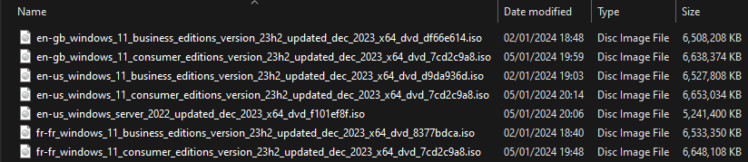

# WindowsMediaDownloader

Module to download Windows ISOs from https://massgrave.dev/genuine-installation-media.html (Thanks [Massgravel](https://github.com/massgravel))

Can download :

- Windows 11 (consumer, business)
- Windows 10 (consumer, business)
- Windows server (2016, 2019, 2022)

Will asks the user for a language for none are specified.

## HowTo

Install it:

`Install-Module -Name WindowsMediaDownloader`

Or simply import it:

`Import-Module .\Module\WindowsMediaDownloader.psd1 -Force`

## Examples

`Invoke-WindowsMediaDownloader -OS '11' -Type 'consumer' -Lang 'en-us'`

Downloads latest consumer version of Windows 11 with language 'en-us'

`Invoke-WindowsMediaDownloader -OS '11' -Type 'consumer'`

Asks to select a language from the availables list and downloads latest consumer version of Windows 11

`Invoke-WindowsMediaDownloader -OS 'server' -Type '2022'`

Asks to select a language from the availables list and downloads latest 2022 version of Windows Server

